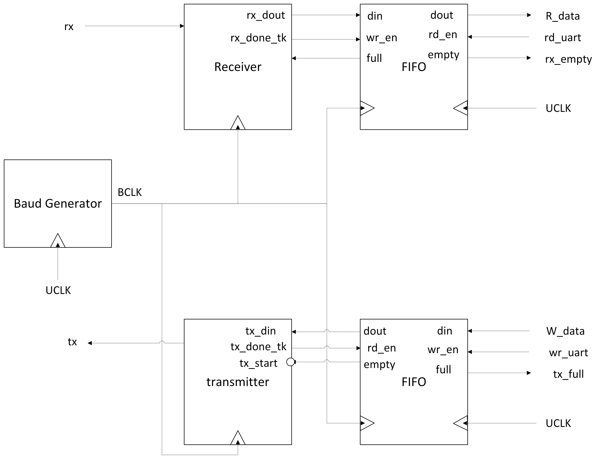

# UART Communication System (Verilog)

This repository contains a complete Verilog implementation of a **Universal Asynchronous Receiver Transmitter (UART)** with support for high-speed data transmission, FIFO buffering, and clock domain crossing.

## 📝 Project Description

The UART module is designed to enable asynchronous serial communication between digital systems. It includes a **Baud Rate Generator**, **UART Transmitter (TX)**, **UART Receiver (RX)**, and **Asynchronous FIFO Buffers** to manage data flow between different clock domains.

This design is aimed at FPGA-based SoC integration and demonstrates how a UART peripheral can be built, verified, and prepared for system-level deployment.

## ⚙️ Features

- **Baud Rate**: 921600 bps (Configurable)
- **Oversampling**: 16x for precise sampling
- **Parameterizable FIFO**: 8-bit data width, 16-depth, separate read/write clocks
- **Clean modular structure**: Easily extensible for SoC integration
- **Testbench included**: Basic and extended test cases
- **Synthesizable & FPGA-ready**
- **Vivado IP Integration**: FIFO generated using Vivado IP Catalog

## 🧪 Verification

- Waveform simulations validate correct transmission and reception.
- Test cases include:
  - Single byte transfer
  - Multiple sequential writes (e.g., `0xAA`, `0x55`)
  - FIFO full/empty conditions
- Future work includes building a **UVM verification environment**.
  
## 🧪 Additional Test Case: TX and RX with Asynchronous Clocks

An advanced test case was added to simulate a real-world UART scenario where the **Transmitter (TX)** and **Receiver (RX)** operate on **independent system clocks**.

### ⚙️ Configuration
- TX Clock (`UCLK_tx`): 125 MHz  
- RX Clock (`UCLK_rx`): 100 MHz  
- Baud Rate: 115200 bps  
- Oversampling: 16x  

Each side generates its own baud tick based on its system clock. The calculated baud tick periods differ slightly, introducing a **~2.35% relative timing error** due to rounding.

Despite this, the system successfully transmitted 2 bytes (`8'hAA`) (`8'h55`) from TX to RX without data corruption. This demonstrates the design’s robustness and tolerance to slight baud mismatches—especially when oversampling is used.

This case helps validate the UART design under asynchronous clock domains, a critical scenario for SoC and board-level communication.

## 🔧 Future Improvements

- Add error detection (parity, framing, overrun)
- Integrate with APB4 as a memory-mapped peripheral
- UVM-based verification
- Interrupt-based data handling
- Hardware prototyping and debugging with Vivado ILA

